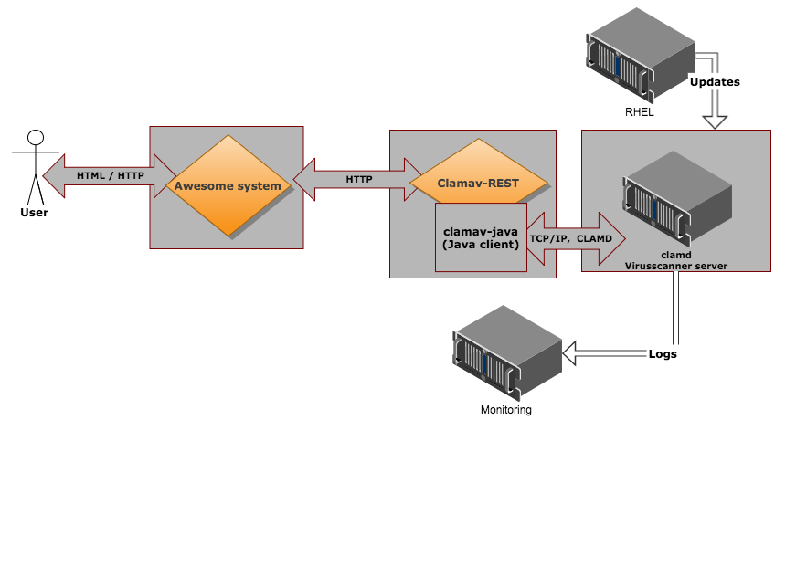

Simple [ClamAV](http://www.clamav.net/) REST proxy. Builds on top of [clamav-java](https://github.com/solita/clamav-java) which is a minimal Java client for ClamAV.

[](https://travis-ci.org/solita/clamav-rest)

# What is it?

## The big picture

This is an example for the deployment. You could omit the log server, it's completely optional.



For more general information, see also [our blog post](http://dev.solita.fi/2015/06/02/rest-virusscan.html).

## The technical details

This is a REST proxy server with support for basic INSTREAM scanning and PING command. 

Clamd protocol is explained here:
http://linux.die.net/man/8/clamd

Clamd protocol contains command such as shutdown so exposing clamd directly to external services is not a feasible option. Accessing clamd directly is fine if you are running single application and it's on the localhost. 

## An example to build on

This is is mainly an example, not a serious production ready server. You can customize this for your specific needs. Or rewrite it using something
other than [Spring Boot](http://projects.spring.io/spring-boot/) if you wish.


# Usage

You have two options. You can use [Docker](https://www.docker.com/) and run a [Docker image](https://hub.docker.com/r/lokori/clamav-rest/) to test it. The Docker image is based on the supplied [Dockerfile specification](https://github.com/solita/clamav-rest/blob/master/Dockerfile).

Or you can build the JAR. This creates a stand-alone JAR with embedded [Jetty serlet container](http://www.eclipse.org/jetty/).

```
  mvn package
```

Starting the REST service is quite straightforward.

```
  java -jar clamav-rest-1.0.2.jar --server.port=8765 --clamd.host=myprecious.clamd.serv.er --clamd.port=3310
```

## Setting up local clamd virtual server

By default clamd is assumed to respond in a local virtual machine. Setting it up is explained in
[ClamAV client](https://github.com/solita/clamav-java) repository. Or you can use a [clamd Docker image](https://hub.docker.com/r/mkodockx/docker-clamav).

# Testing the REST service

You can use [curl](http://curl.haxx.se/) as it's REST. Here's an example test session:

```
curl localhost:8080
Clamd responding: true

curl -F "name=blabla" -F "file=@./eicar.txt" localhost:8080/scan
Everything ok : false
```

EICAR is a test file which is recognized as a virus by scanners even though it's not really a virus. Read more [EICAR information here](http://www.eicar.org/86-0-Intended-use.html).


# License

Copyright © 2014 [Solita](http://www.solita.fi)

Distributed under the GNU Lesser General Public License, either version 2.1 of the License, or 
(at your option) any later version.

